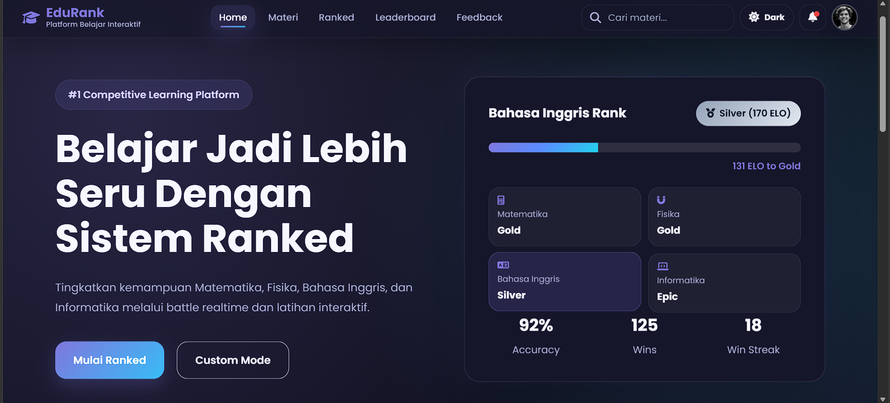
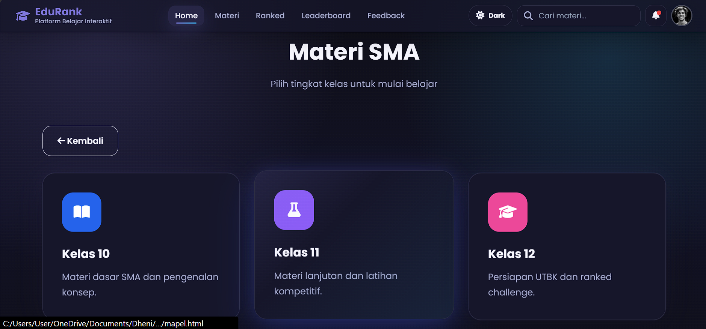
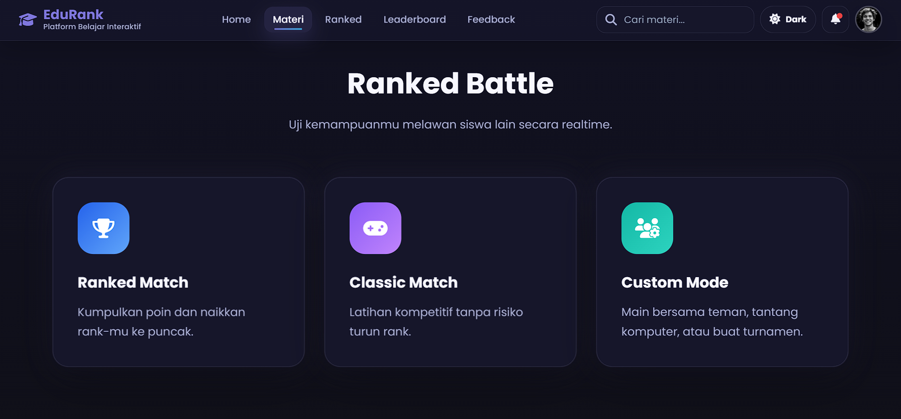
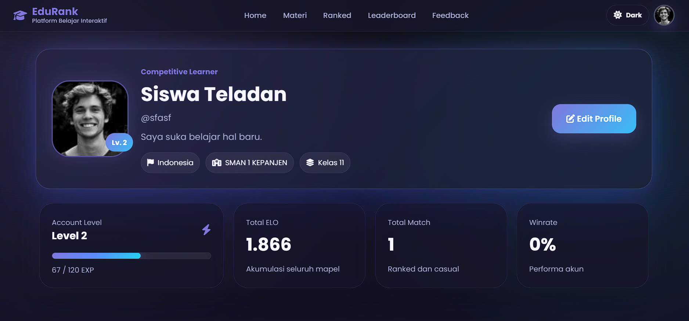
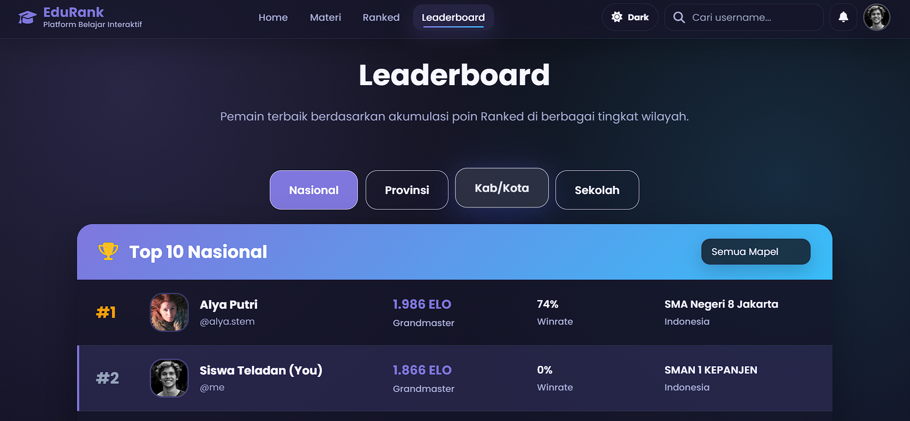

# 🎓 EduRank
### Competitive Learning Platform With Ranked System

EduRank adalah platform pembelajaran kompetitif modern yang menggabungkan sistem belajar interaktif dengan fitur ranked battle untuk meningkatkan motivasi belajar siswa. Website ini menyediakan materi pembelajaran, latihan soal, leaderboard, dan mode pertandingan edukatif yang membuat proses belajar menjadi lebih seru, menantang, dan kompetitif.

---

# 🚀 Demo Website

🔗 https://dhendelions.github.io/Prototype-WebApps/
### Klik link untuk membuka prototype WebApp

---

# 👨‍💻 Anggota Kelompok

1. Akbar Ivana Wijaya  
2. Crissencio Dheni Sunarke  
3. Muhammad Mirza Al Farrosy  
4. Nur Muhammad Fahrul  
5. Izrasyiar Qolbu Ridhoni  

---

# ✨ Key Features

✅ Ranked Battle System  
✅ Classic & Custom Mode  
✅ Dark / Light Mode  
✅ Responsive Navbar  
✅ Search Materi  
✅ Leaderboard System  
✅ Modern UI Design  
✅ Notification Dropdown  
✅ Competitive Learning  
✅ Animated Interface  
✅ Mobile Friendly  

---

# 📚 Mata Pelajaran Utama

EduRank berfokus pada pembelajaran kompetitif untuk:

- ➕ Matematika  
- ⚛️ Fisika  
- 💻 Informatika  
- 🇬🇧 Bahasa Inggris  

---

# 🎮 Mode Permainan

## 🔥 Ranked Mode
EduRank menggunakan sistem kompetitif berbasis rank dan ELO seperti game online modern.

- Pemain akan bertanding melawan siswa lain secara realtime.
- Setiap kemenangan akan menambah ELO.
- Kekalahan dapat mengurangi ELO.
- Semakin tinggi rank, semakin sulit lawan yang dihadapi.
- Leaderboard menampilkan pemain terbaik secara global.

---

## 🟦 Classic Mode
Mode latihan kompetitif tanpa mempengaruhi rank atau ELO.

- Tidak mempengaruhi peringkat
- Fokus latihan & peningkatan skill
- Bisa dimainkan berulang tanpa risiko turun rank
- Cocok untuk pemanasan sebelum Ranked Match
- Soal tetap kompetitif tapi lebih santai

---

## 🟨 Custom Mode
Mode fleksibel yang memungkinkan pemain memilih jenis permainan sesuai kebutuhan.

### 👥 Lawan Teman
- Bertanding langsung dengan teman
- Bisa membuat atau join room
- Aturan bisa disesuaikan (mapel, jumlah soal, waktu)
- Cocok untuk latihan atau adu skill
  
---

### 🤖 Lawan AI
- Bertanding melawan sistem AI (bot)
- Tingkat kesulitan bisa dipilih
- Cocok saat tidak ada lawan online
- AI menyesuaikan kemampuan pemain

👉 Tujuan: **latihan mandiri kapan saja**

---

### 🏆 Turnamen Mode
- Kompetisi dengan banyak pemain
- Sistem eliminasi atau leaderboard
- Bisa event resmi atau buatan user/admin
- Pemenang ditentukan berdasarkan skor tertinggi

👉 Tujuan: **kompetisi besar seperti event atau lomba**

---

# 🥇 Tingkatan Rank
Sistem rank di EduRank menggunakan sistem ELO untuk menentukan level kemampuan pemain.

| Rank | Badge | ELO |
|------|------|------|
| Bronze | 🥉 | 1 - 100 |
| Silver | 🥈 | 101 - 300 |
| Gold | 🥇 | 301 - 600 |
| Epic | 🔷 | 601 - 1000 |
| Heroic | 🟣 | 1001 - 1350 |
| Master | 🟡 | 1351 - 1650 |
| Grandmaster | 🔥 | 1651 - 2000 |
| Professor | 🎓 | 2000+ |

---

# 🖼️ Preview Website

## 🏠 Homepage



---

## 📚 Materi Page



---

## 🏆 Ranked Battle



---

# 👤 Profile

<p align="center">
  
</p>

---

# 🏆 Leaderboard System

Leaderboard menampilkan pemain terbaik berdasarkan total ELO dan performa ranked battle.



---

# 🛠️ Technologies Used

| Technology | Description |
|------------|-------------|
| HTML5 | Struktur Website |
| CSS3 | Styling Website |
| JavaScript | Interaksi Website |
| Font Awesome | Icons |
| Google Fonts | Typography |

---

# ⚙️ Cara Menjalankan Project

## 1️⃣ Clone Repository

```bash
git clone https://github.com/Dhendelions/Prototype-ASpire.git
```

---

## 2️⃣ Masuk ke Folder

```bash
cd Prototype-ASpire
```

---

## 3️⃣ Jalankan Website

Buka:

```bash
index.html
```

atau gunakan:

- Live Server VSCode

---

# 🌙 Dark Mode

EduRank mendukung:

- ☀️ Light Mode  
- 🌙 Dark Mode  

Tema otomatis tersimpan menggunakan:

```javascript
localStorage
```

---

# 📱 Responsive Design

Website sudah responsive untuk:

✅ Mobile  
✅ Tablet  
✅ Laptop  
✅ Desktop  

---

# 🔥 Future Development

- [ ] Multiplayer Realtime  
- [ ] AI Question Generator  
- [ ] Achievement System  
- [ ] Tournament System  
- [ ] Chat System  
- [ ] Database Integration  
- [ ] Login Authentication  

---

# 📌 Catatan

- Project masih tahap prototype  
- Sebagian fitur masih menggunakan dummy data  
- Gunakan browser modern untuk pengalaman terbaik  

---

# ⭐ Support

Jika project ini membantu:

⭐ Berikan Star pada repository GitHub ini  

---

# 📄 License

Copyright © 2026 Kelompok 12 Aspire  
All Rights Reserved  

---

<p align="center">
  Made with ❤️ by Kelompok 12 Aspire
</p>
